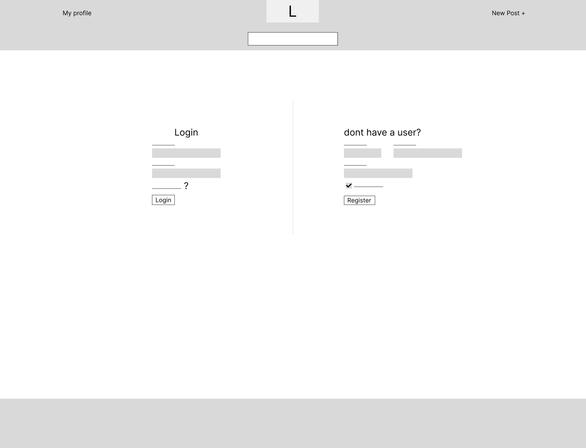

# About JoinIn

My Bootstrap school assignment
Task was to create a social media application / page using only Bootstrap.

## link to Netlify:

https://capable-dusk-443a7f.netlify.app/

## things to know

contacts on profile.html is a wrong on bigger screen sizes, tried to fix it, have not been successfull yet.

because of the layout i put on profile.html, the new post section will appear over new post button rather than under..

After recent feedback, i have choosen to edit the layout on bigger screens for feed.html. This include moving search to right side above contacts, and have the feed centered on the left part of the page. Because of this, the wireframe is a little bit diffrent, even though i never intended for the search to be placed on the left part.

The reason the search bar is moved from header to main on pc is because of the layout of the nav elements. that made it really complicated to do so, and i thought it was a good idea to move it down.

## Original design / wireframe

Here are some images of how i wanted the site to look like:
### Login: 

### Feed:

#### a newer version of the feed / how i wanted the posts

### profile:

## What is being used

Bootstrap
Bootstrap icons
sass to customize bootstrap (only two colors, primary and warning)

example post image from unsplash.com
&
sample images from https://picsum.photos/

